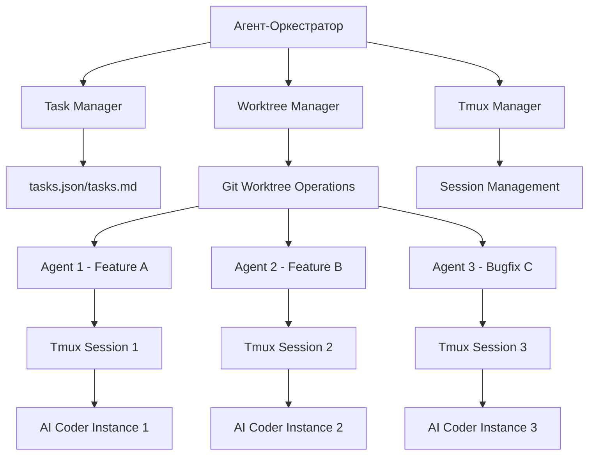

# 🤖 Руководство по Рабочему Процессу Самогенерирующихся Команд AI-Кодеров

> **Библия VibeCoder** - Современное Руководство по Оркестрации AI-Агентов  
> *Версия 2.0 - Обновлено для 2025 года*

## 📚 Содержание

1. [Введение](#введение)
2. [Преимущества Подхода](#преимущества-подхода)
3. [Ключевые Технологии](#ключевые-технологии)
4. [Архитектура Системы](#архитектура-системы)
5. [Пошаговая Настройка](#пошаговая-настройка)
6. [Практические Примеры](#практические-примеры)
7. [Мониторинг и Отладка](#мониторинг-и-отладка)
8. [Лучшие Практики](#лучшие-практики)
9. [Устранение Проблем](#устранение-проблем)
10. [Дополнительные Ресурсы](#дополнительные-ресурсы)

---

## 🌟 Введение

В эпоху массового использования AI-кодеров (Claude, GPT-4, Cursor AI, Codeium, GitHub Copilot) традиционная работа с множественными окнами терминала стала узким местом продуктивности. Данное руководство представляет **революционный подход к оркестрации команд AI-агентов**, позволяющий:

- ✅ **Параллельное выполнение** задач несколькими AI-кодерами
- ✅ **Автоматизированное управление** жизненным циклом задач
- ✅ **Предотвращение конфликтов** при работе с кодом
- ✅ **Масштабируемость** от 2 до 50+ агентов
- ✅ **Восстановление после сбоев** и мониторинг в реальном времени

### 🎯 Для кого это руководство?

- **Разработчики**, работающие с AI-инструментами
- **DevOps-инженеры**, автоматизирующие процессы
- **Команды**, желающие масштабировать использование AI
- **Исследователи**, изучающие multi-agent системы

---

## 🚀 Преимущества Подхода

### Без системы оркестрации:
```bash
# Проблемы традиционного подхода
❌ Ручное открытие 5-10 терминалов
❌ Конфликты при одновременном редактировании файлов
❌ Потеря контроля над процессами
❌ Сложность синхронизации изменений
❌ Высокий риск перезаписи кода
```

### С системой оркестрации:
```bash
# Преимущества автоматизированного подхода
✅ Один командный центр управления
✅ Изолированные рабочие среды для каждого агента
✅ Автоматическое слияние изменений
✅ Полный контроль и мониторинг
✅ Масштабирование до 50+ параллельных задач
```

---

## 🛠️ Ключевые Технологии

### 1. 🌳 Git Worktrees (Рабочие Деревья)

**Git Worktrees** - это не ветки! Это полноценные **физические копии** репозитория, позволяющие работать с разными задачами в изолированных директориях.

#### Основные преимущества:
- **Полная изоляция** каждой задачи
- **Независимые зависимости** (node_modules, venv и т.д.)
- **Параллельная сборка** и тестирование
- **Безопасное экспериментирование**

#### Создание Worktree:
```bash
# Базовый синтаксис
git worktree add -b <branch-name> <directory> [<start-point>]

# Примеры
git worktree add -b feature/user-auth work_directory/user-auth
git worktree add -b bugfix/memory-leak work_directory/memory-leak
git worktree add -b refactor/api-layer work_directory/api-refactor

# Проверка всех worktrees
git worktree list
```

#### Структура проекта с Worktrees:
```
my-project/
├── .git/                           # Основной Git репозиторий
├── src/                           # Основная кодовая база
├── package.json
└── work_directory/                # Рабочие деревья
    ├── user-auth/                 # Изолированная копия для аутентификации
    │   ├── .git                   # Ссылка на основной репозиторий
    │   ├── src/
    │   ├── node_modules/          # Независимые зависимости
    │   └── package.json
    ├── memory-leak/               # Изолированная копия для исправления багов
    └── api-refactor/              # Изолированная копия для рефакторинга
```

### 2. 🖥️ Tmux (Terminal Multiplexer)

**Tmux** - мощный терминальный мультиплексор для управления фоновыми процессами и сессиями.

#### Установка:
```bash
# macOS
brew install tmux

# Ubuntu/Debian
sudo apt-get install tmux

# CentOS/RHEL
sudo yum install tmux
```

#### Основные команды:
```bash
# Создание новой сессии
tmux new-session -d -s <session-name>
tmux new-session -d -s "ai-agent-auth"

# Выполнение команды в сессии
tmux send-keys -t <session-name> "<command>" Enter
tmux send-keys -t "ai-agent-auth" "cd work_directory/user-auth" Enter
tmux send-keys -t "ai-agent-auth" "cursor ." Enter

# Подключение к сессии
tmux attach-session -t <session-name>

# Отключение от сессии (внутри tmux)
Ctrl + b, затем d

# Просмотр всех сессий
tmux list-sessions

# Завершение сессии
tmux kill-session -t <session-name>
```

#### Расширенная конфигурация Tmux:
```bash
# Создание файла ~/.tmux.conf
cat > ~/.tmux.conf << 'EOF'
# Более удобные клавиши
set -g prefix C-a
unbind C-b
bind C-a send-prefix

# Включение мыши
set -g mouse on

# Настройка истории
set -g history-limit 10000

# Статусная строка
set -g status-bg black
set -g status-fg white
set -g status-interval 60
set -g status-left-length 30
set -g status-left '#[fg=green](#S) #(whoami)'
set -g status-right '#[fg=yellow]#(cut -d " " -f 1-3 /proc/loadavg)#[default] #[fg=white]%H:%M#[default]'
EOF

# Перезагрузка конфигурации
tmux source-file ~/.tmux.conf
```

### 3. 🤖 AI-Кодеры и Инструменты

#### Поддерживаемые AI-кодеры:
```bash
# Claude AI (через API или интерфейс)
claude-cli --model claude-3-sonnet --project work_directory/user-auth

# Cursor AI
cursor work_directory/user-auth

# GitHub Copilot с VS Code
code work_directory/user-auth

# Codeium
codeium-cli --workspace work_directory/user-auth

# Custom AI agents (через API)
python ai_agent.py --workspace work_directory/user-auth --task "implement user authentication"
```

---

## 🏗️ Архитектура Системы

### Компоненты системы:



### Файловая структура:
```
project-root/
├── .ai-orchestrator/              # Конфигурация оркестратора
│   ├── config.json
│   ├── templates/
│   └── logs/
├── tasks.md                       # Список задач
├── work_directory/                # Рабочие деревья
│   ├── feature-auth/
│   ├── bugfix-memory/
│   └── refactor-api/
├── scripts/                       # Автоматизация
│   ├── spawn-agent.sh
│   ├── monitor-agents.sh
│   └── merge-worktree.sh
└── .orchestrator.md              # Инструкции для агента-оркестратора
```

---

## 📋 Пошаговая Настройка

### Шаг 1: Подготовка Файла Задач

Создайте структурированный файл `tasks.md`:

```markdown
# 🎯 AI Team Tasks

## Metadata
- **Project**: VibeCoding Platform
- **Created**: 2025-06-30
- **Total Tasks**: 6
- **Completed**: 0

## 📋 Task List

### 🔐 Task 1: User Authentication System
- **ID**: `auth-001`
- **Branch Name**: `feature/user-authentication`
- **Priority**: High
- **Status**: `pending`
- **Estimated Time**: 4 hours
- **Dependencies**: None
- **Tmux Session**: `ai-auth-agent`
- **Description**: Implement complete JWT-based authentication with login, registration, and password reset
- **Acceptance Criteria**:
  - [ ] User registration with email validation
  - [ ] Login/logout functionality
  - [ ] JWT token management
  - [ ] Password reset flow
  - [ ] Unit tests coverage > 80%

### 🎨 Task 2: UI/UX Improvements
- **ID**: `ui-001`
- **Branch Name**: `feature/ui-improvements`
- **Priority**: Medium
- **Status**: `pending`
- **Dependencies**: None
- **Tmux Session**: `ai-ui-agent`
- **Description**: Modernize the user interface with responsive design
- **Acceptance Criteria**:
  - [ ] Mobile-responsive design
  - [ ] Dark/light theme toggle
  - [ ] Improved navigation
  - [ ] Accessibility compliance (WCAG 2.1)

### 🐛 Task 3: Memory Leak Fix
- **ID**: `bug-001`
- **Branch Name**: `bugfix/memory-leak-api`
- **Priority**: Critical
- **Status**: `pending`
- **Dependencies**: None
- **Tmux Session**: `ai-bugfix-agent`
- **Description**: Identify and fix memory leaks in API endpoints
- **Acceptance Criteria**:
  - [ ] Memory profiling completed
  - [ ] Leaks identified and fixed
  - [ ] Performance tests added
  - [ ] Memory usage under 512MB

### 🔄 Task 4: API Refactoring
- **ID**: `refactor-001`
- **Branch Name**: `refactor/api-endpoints`
- **Priority**: Medium
- **Status**: `pending`
- **Dependencies**: `bug-001` (memory leak must be fixed first)
- **Tmux Session**: `ai-refactor-agent`
- **Description**: Refactor API endpoints for better performance and maintainability
- **Acceptance Criteria**:
  - [ ] RESTful design principles
  - [ ] OpenAPI documentation
  - [ ] Response time < 200ms
  - [ ] Error handling improvements

### 📊 Task 5: Analytics Dashboard
- **ID**: `analytics-001`
- **Branch Name**: `feature/analytics-dashboard`
- **Priority**: Low
- **Status**: `pending`
- **Dependencies**: `auth-001`, `ui-001`
- **Tmux Session**: `ai-analytics-agent`
- **Description**: Create analytics dashboard for user behavior tracking
- **Acceptance Criteria**:
  - [ ] Real-time metrics
  - [ ] Interactive charts
  - [ ] Export functionality
  - [ ] Role-based access

### 🧪 Task 6: Test Suite Enhancement
- **ID**: `test-001`
- **Branch Name**: `improvement/test-coverage`
- **Priority**: High
- **Status**: `pending`
- **Dependencies**: None
- **Tmux Session**: `ai-test-agent`
- **Description**: Improve test coverage and add integration tests
- **Acceptance Criteria**:
  - [ ] Unit test coverage > 90%
  - [ ] Integration tests for all APIs
  - [ ] E2E tests for critical flows
  - [ ] Performance benchmarks
```

### Шаг 2: Создание Агента-Оркестратора

Создайте файл `.ai-orchestrator/orchestrator-prompt.md`:

```markdown
# 🎭 AI Team Orchestrator - System Prompt

## 🎯 Your Role
You are an **AI Team Orchestrator** responsible for spawning, managing, and coordinating multiple AI coding agents. Your primary mission is to efficiently distribute work across a team of AI agents while preventing conflicts and ensuring high-quality code delivery.

## 🧠 Core Responsibilities

### 1. Task Analysis & Distribution
- **Read** and parse the `tasks.md` file
- **Analyze** task dependencies and priorities
- **Group** related tasks for single-agent execution
- **Distribute** independent tasks across multiple agents

### 2. Environment Management
- **Create** isolated Git worktrees for each task/agent
- **Spawn** Tmux sessions for background processing
- **Monitor** agent progress and status
- **Handle** error recovery and intervention requests

### 3. Code Quality & Integration
- **Review** completed work before merging
- **Resolve** conflicts between agents
- **Ensure** coding standards compliance
- **Coordinate** integration testing

## 🛠️ Available Tools & Commands

### Git Worktree Operations
```bash
# Create worktree
git worktree add -b <branch-name> work_directory/<folder-name>

# List all worktrees
git worktree list

# Remove worktree
git worktree remove work_directory/<folder-name>

# Merge completed work
cd work_directory/<folder-name>
git add . && git commit -m "feat: <description>"
cd ../../
git checkout main
git merge <branch-name>
```

### Tmux Session Management
```bash
# Create and detach session
tmux new-session -d -s <session-name>

# Send commands to session
tmux send-keys -t <session-name> "<command>" Enter

# Check session status
tmux capture-pane -t <session-name> -p

# Monitor all sessions
tmux list-sessions
```

### Agent Spawning Commands
```bash
# Spawn Claude AI agent
tmux send-keys -t <session-name> "claude-cli --model claude-3-sonnet --workspace . --task '${TASK_DESCRIPTION}'" Enter

# Spawn Cursor AI agent
tmux send-keys -t <session-name> "cursor . && echo 'AI Agent Ready for: ${TASK_DESCRIPTION}'" Enter

# Spawn custom Python agent
tmux send-keys -t <session-name> "python ../scripts/ai_agent.py --task '${TASK_DESCRIPTION}' --workspace ." Enter
```

## 📋 Workflow Steps

### Step 1: Initialize Orchestration
1. Read and validate `tasks.md`
2. Check Git repository status
3. Ensure clean working directory
4. Verify required tools (tmux, git, AI clients)

### Step 2: Task Prioritization
1. Identify critical and blocking tasks
2. Group dependent tasks together
3. Create execution plan with timeline
4. Update task statuses to "planning"

### Step 3: Agent Spawning
For each task or task group:
1. Create Git worktree: `work_directory/<task-name>`
2. Create Tmux session: `ai-<task-name>-agent`
3. Navigate to worktree directory
4. Launch appropriate AI coder
5. Provide task context and acceptance criteria
6. Update task status to "in_progress"

### Step 4: Monitoring & Coordination
1. Regularly check agent progress (every 15 minutes)
2. Capture tmux session outputs
3. Identify agents needing intervention
4. Provide guidance when agents are stuck
5. Update task statuses in real-time

### Step 5: Integration & Cleanup
1. Review completed work in each worktree
2. Run tests and quality checks
3. Merge successful implementations
4. Clean up completed worktrees
5. Update final task statuses

## 🚨 Error Handling

### Common Issues & Solutions
- **Agent Stuck**: Provide specific guidance or restart with clearer instructions
- **Merge Conflicts**: Manually resolve or guide agent through resolution
- **Test Failures**: Identify root cause and assign remediation
- **Dependency Issues**: Coordinate dependent tasks completion

### Intervention Triggers
- Agent inactive for > 30 minutes
- Multiple test failures
- Request for human input
- Unexpected errors or exceptions

## 📊 Status Reporting

### Task Status Values
- `pending`: Not yet started
- `planning`: Orchestrator analyzing task
- `claimed`: Assigned to specific agent
- `in_progress`: Agent actively working
- `review_needed`: Implementation complete, needs review
- `intervention_required`: Human input needed
- `completed`: Successfully finished and merged
- `failed`: Task failed and needs reassignment

### Progress Updates
Regularly update `tasks.md` with:
- Current status
- Completion percentage
- Time remaining estimates
- Any blockers or issues
- Tmux session names

## 🎯 Success Criteria
- All tasks completed within estimated timeframes
- Zero merge conflicts during integration
- All tests passing before final merge
- Clean, maintainable code following project standards
- Complete documentation for new features
```

### Шаг 3: Создание Автоматизированных Скриптов

#### Скрипт запуска агента (`scripts/spawn-agent.sh`):
```bash
#!/bin/bash

# AI Agent Spawner Script
# Usage: ./spawn-agent.sh <task-id> <branch-name> <tmux-session> <ai-tool>

set -e

TASK_ID=$1
BRANCH_NAME=$2
TMUX_SESSION=$3
AI_TOOL=${4:-"cursor"}
WORKSPACE_DIR="work_directory/${TASK_ID}"

echo "🚀 Spawning AI Agent for Task: ${TASK_ID}"

# Step 1: Create Git Worktree
echo "📁 Creating Git worktree..."
if [ ! -d "${WORKSPACE_DIR}" ]; then
    git worktree add -b "${BRANCH_NAME}" "${WORKSPACE_DIR}"
    echo "✅ Worktree created: ${WORKSPACE_DIR}"
else
    echo "⚠️  Worktree already exists: ${WORKSPACE_DIR}"
fi

# Step 2: Create Tmux Session
echo "🖥️  Creating Tmux session..."
if ! tmux has-session -t "${TMUX_SESSION}" 2>/dev/null; then
    tmux new-session -d -s "${TMUX_SESSION}"
    echo "✅ Tmux session created: ${TMUX_SESSION}"
else
    echo "⚠️  Tmux session already exists: ${TMUX_SESSION}"
fi

# Step 3: Navigate to workspace
echo "📂 Navigating to workspace..."
tmux send-keys -t "${TMUX_SESSION}" "cd ${WORKSPACE_DIR}" Enter

# Step 4: Install dependencies if needed
echo "📦 Installing dependencies..."
if [ -f "${WORKSPACE_DIR}/package.json" ]; then
    tmux send-keys -t "${TMUX_SESSION}" "npm install" Enter
    sleep 5
elif [ -f "${WORKSPACE_DIR}/requirements.txt" ]; then
    tmux send-keys -t "${TMUX_SESSION}" "pip install -r requirements.txt" Enter
    sleep 5
fi

# Step 5: Launch AI tool
echo "🤖 Launching AI tool: ${AI_TOOL}"
case ${AI_TOOL} in
    "cursor")
        tmux send-keys -t "${TMUX_SESSION}" "cursor ." Enter
        ;;
    "claude")
        tmux send-keys -t "${TMUX_SESSION}" "claude-cli --workspace ." Enter
        ;;
    "code")
        tmux send-keys -t "${TMUX_SESSION}" "code ." Enter
        ;;
    *)
        echo "⚠️  Unknown AI tool: ${AI_TOOL}"
        tmux send-keys -t "${TMUX_SESSION}" "echo 'Please specify AI tool manually'" Enter
        ;;
esac

echo "🎉 Agent spawned successfully!"
echo "📋 To monitor: tmux attach -t ${TMUX_SESSION}"
echo "🔄 To detach: Ctrl+b, then d"
```

#### Скрипт мониторинга (`scripts/monitor-agents.sh`):
```bash
#!/bin/bash

# AI Agents Monitor Script
# Usage: ./monitor-agents.sh [--detailed]

DETAILED=${1:-""}

echo "🔍 Monitoring AI Agents Status"
echo "================================"

# Get all tmux sessions starting with 'ai-'
SESSIONS=$(tmux list-sessions 2>/dev/null | grep '^ai-' | cut -d: -f1 || echo "")

if [ -z "$SESSIONS" ]; then
    echo "❌ No AI agent sessions found"
    exit 0
fi

for SESSION in $SESSIONS; do
    echo "🤖 Session: $SESSION"
    
    # Check if session is responsive
    if tmux has-session -t "$SESSION" 2>/dev/null; then
        # Get last activity
        LAST_ACTIVITY=$(tmux display-message -t "$SESSION" -p "#{session_activity}")
        CURRENT_TIME=$(date +%s)
        IDLE_TIME=$((CURRENT_TIME - LAST_ACTIVITY))
        
        echo "   Status: 🟢 Active"
        echo "   Idle time: ${IDLE_TIME}s"
        
        if [ "$DETAILED" = "--detailed" ]; then
            echo "   Last output:"
            tmux capture-pane -t "$SESSION" -p | tail -3 | sed 's/^/   > /'
        fi
        
        # Check if agent seems stuck (idle > 1800s = 30 minutes)
        if [ $IDLE_TIME -gt 1800 ]; then
            echo "   ⚠️  WARNING: Agent may be stuck (idle > 30 min)"
        fi
    else
        echo "   Status: ❌ Inactive"
    fi
    
    echo ""
done

echo "💡 Use './monitor-agents.sh --detailed' for more information"
echo "🔧 To attach to session: tmux attach -t <session-name>"
```

#### Скрипт слияния (`scripts/merge-worktree.sh`):
```bash
#!/bin/bash

# Merge Worktree Script
# Usage: ./merge-worktree.sh <task-id> <branch-name>

set -e

TASK_ID=$1
BRANCH_NAME=$2
WORKSPACE_DIR="work_directory/${TASK_ID}"

echo "🔄 Merging worktree for Task: ${TASK_ID}"

# Step 1: Verify worktree exists
if [ ! -d "${WORKSPACE_DIR}" ]; then
    echo "❌ Worktree not found: ${WORKSPACE_DIR}"
    exit 1
fi

# Step 2: Check worktree status
echo "📊 Checking worktree status..."
cd "${WORKSPACE_DIR}"

# Verify no uncommitted changes
if ! git diff --quiet || ! git diff --cached --quiet; then
    echo "⚠️  Uncommitted changes found. Committing..."
    git add .
    git commit -m "feat(${TASK_ID}): auto-commit before merge"
fi

# Step 3: Run tests if test script exists
if [ -f "package.json" ] && npm run test --if-present; then
    echo "✅ Tests passed"
elif [ -f "pytest.ini" ] || [ -f "conftest.py" ]; then
    if pytest; then
        echo "✅ Tests passed"
    else
        echo "❌ Tests failed. Aborting merge."
        exit 1
    fi
else
    echo "⚠️  No tests found, proceeding with merge"
fi

# Step 4: Switch to main and merge
echo "🔄 Switching to main branch..."
cd ../../
git checkout main

echo "🔄 Merging branch: ${BRANCH_NAME}"
if git merge "${BRANCH_NAME}" --no-ff -m "feat(${TASK_ID}): merge completed task"; then
    echo "✅ Merge successful"
    
    # Step 5: Cleanup
    echo "🧹 Cleaning up..."
    git worktree remove "${WORKSPACE_DIR}"
    git branch -d "${BRANCH_NAME}"
    
    echo "🎉 Task ${TASK_ID} completed and merged successfully!"
else
    echo "❌ Merge failed. Please resolve conflicts manually."
    exit 1
fi
```

### Шаг 4: Создание Конфигурации

#### Файл конфигурации (`.ai-orchestrator/config.json`):
```json
{
  "project": {
    "name": "VibeCoding Platform",
    "version": "1.0.0",
    "main_branch": "main",
    "work_directory": "work_directory"
  },
  "ai_tools": {
    "default": "cursor",
    "available": [
      {
        "name": "cursor",
        "command": "cursor .",
        "description": "Cursor AI IDE"
      },
      {
        "name": "claude",
        "command": "claude-cli --workspace .",
        "description": "Claude AI CLI"
      },
      {
        "name": "code",
        "command": "code .",
        "description": "VS Code with Copilot"
      }
    ]
  },
  "monitoring": {
    "check_interval": 900,
    "max_idle_time": 1800,
    "log_level": "INFO"
  },
  "quality_gates": {
    "require_tests": true,
    "min_test_coverage": 80,
    "run_linting": true,
    "require_documentation": false
  },
  "tmux": {
    "session_prefix": "ai-",
    "config_file": "~/.tmux.conf"
  },
  "notifications": {
    "webhook_url": null,
    "slack_channel": null,
    "email_alerts": false
  }
}
```

---

## 🧪 Практические Примеры

### Пример 1: Запуск Команды из 3 Агентов

```bash
# 1. Подготовка проекта
cd my-project
git checkout main
git pull origin main

# 2. Создание файла задач (tasks.md уже готов)

# 3. Запуск агентов для независимых задач
./scripts/spawn-agent.sh auth-001 feature/user-authentication ai-auth-agent cursor
./scripts/spawn-agent.sh ui-001 feature/ui-improvements ai-ui-agent cursor  
./scripts/spawn-agent.sh bug-001 bugfix/memory-leak-api ai-bugfix-agent cursor

# 4. Мониторинг прогресса
./scripts/monitor-agents.sh --detailed

# 5. Проверка статуса каждого агента
tmux attach -t ai-auth-agent     # Ctrl+b, d для выхода
tmux attach -t ai-ui-agent       # Ctrl+b, d для выхода  
tmux attach -t ai-bugfix-agent   # Ctrl+b, d для выхода

# 6. Слияние завершенных задач
./scripts/merge-worktree.sh auth-001 feature/user-authentication
./scripts/merge-worktree.sh ui-001 feature/ui-improvements
./scripts/merge-worktree.sh bug-001 bugfix/memory-leak-api
```

### Пример 2: Автоматизированный Оркестратор

Создайте Python-скрипт для полной автоматизации (`scripts/orchestrator.py`):

```python
#!/usr/bin/env python3
"""
AI Team Orchestrator - Automated Agent Management
"""

import json
import subprocess
import time
import re
from datetime import datetime, timedelta
from pathlib import Path
from typing import List, Dict, Any

class AIOrchestrator:
    def __init__(self, config_path: str = ".ai-orchestrator/config.json"):
        self.config = self._load_config(config_path)
        self.tasks = self._load_tasks()
        self.active_agents = {}
        
    def _load_config(self, config_path: str) -> Dict[str, Any]:
        """Load orchestrator configuration"""
        with open(config_path, 'r') as f:
            return json.load(f)
    
    def _load_tasks(self) -> List[Dict[str, Any]]:
        """Parse tasks from tasks.md file"""
        tasks = []
        with open('tasks.md', 'r') as f:
            content = f.read()
            
        # Extract tasks using regex (simplified parser)
        task_pattern = r'### .*?Task \d+: (.*?)\n.*?- \*\*ID\*\*: `(.*?)`.*?- \*\*Branch Name\*\*: `(.*?)`.*?- \*\*Status\*\*: `(.*?)`.*?- \*\*Tmux Session\*\*: `(.*?)`'
        matches = re.findall(task_pattern, content, re.DOTALL)
        
        for match in matches:
            task = {
                'title': match[0],
                'id': match[1], 
                'branch': match[2],
                'status': match[3],
                'tmux_session': match[4],
                'dependencies': self._extract_dependencies(content, match[1])
            }
            tasks.append(task)
            
        return tasks
    
    def _extract_dependencies(self, content: str, task_id: str) -> List[str]:
        """Extract task dependencies"""
        # Simplified dependency extraction
        deps_pattern = rf'- \*\*Dependencies\*\*: `(.*?)`'
        deps_match = re.search(deps_pattern, content)
        if deps_match and deps_match.group(1) != 'None':
            return [dep.strip() for dep in deps_match.group(1).split(',')]
        return []
    
    def can_start_task(self, task: Dict[str, Any]) -> bool:
        """Check if task dependencies are satisfied"""
        if not task['dependencies']:
            return True
            
        for dep in task['dependencies']:
            dep_task = next((t for t in self.tasks if t['id'] == dep), None)
            if not dep_task or dep_task['status'] != 'completed':
                return False
        return True
    
    def spawn_agent(self, task: Dict[str, Any]) -> bool:
        """Spawn AI agent for given task"""
        try:
            cmd = [
                './scripts/spawn-agent.sh',
                task['id'],
                task['branch'], 
                task['tmux_session'],
                self.config['ai_tools']['default']
            ]
            
            result = subprocess.run(cmd, capture_output=True, text=True)
            if result.returncode == 0:
                self.active_agents[task['id']] = {
                    'task': task,
                    'started': datetime.now(),
                    'last_check': datetime.now()
                }
                self._update_task_status(task['id'], 'in_progress')
                print(f"✅ Agent spawned for task: {task['id']}")
                return True
            else:
                print(f"❌ Failed to spawn agent for task {task['id']}: {result.stderr}")
                return False
                
        except Exception as e:
            print(f"❌ Error spawning agent for task {task['id']}: {e}")
            return False
    
    def check_agent_status(self, task_id: str) -> str:
        """Check status of specific agent"""
        try:
            agent = self.active_agents[task_id]
            session = agent['task']['tmux_session']
            
            # Check if tmux session exists
            result = subprocess.run(
                ['tmux', 'has-session', '-t', session],
                capture_output=True
            )
            
            if result.returncode != 0:
                return 'failed'
            
            # Get last activity
            result = subprocess.run(
                ['tmux', 'display-message', '-t', session, '-p', '#{session_activity}'],
                capture_output=True, text=True
            )
            
            if result.returncode == 0:
                last_activity = int(result.stdout.strip())
                current_time = int(time.time())
                idle_time = current_time - last_activity
                
                if idle_time > self.config['monitoring']['max_idle_time']:
                    return 'intervention_required'
                else:
                    return 'active'
            
            return 'unknown'
            
        except Exception as e:
            print(f"❌ Error checking agent status for {task_id}: {e}")
            return 'error'
    
    def _update_task_status(self, task_id: str, status: str):
        """Update task status in tasks.md file"""
        with open('tasks.md', 'r') as f:
            content = f.read()
        
        # Replace status for specific task
        pattern = rf'(### .*?{task_id}.*?- \*\*Status\*\*: )`.*?`'
        replacement = rf'\1`{status}`'
        content = re.sub(pattern, replacement, content, flags=re.DOTALL)
        
        with open('tasks.md', 'w') as f:
            f.write(content)
    
    def monitor_agents(self):
        """Monitor all active agents"""
        print(f"🔍 Monitoring {len(self.active_agents)} active agents...")
        
        for task_id, agent in self.active_agents.items():
            status = self.check_agent_status(task_id)
            print(f"🤖 Agent {task_id}: {status}")
            
            if status == 'intervention_required':
                print(f"⚠️  Agent {task_id} requires intervention")
                # Could send notification here
            
            agent['last_check'] = datetime.now()
    
    def start_available_tasks(self):
        """Start all tasks that can be started"""
        for task in self.tasks:
            if (task['status'] == 'pending' and 
                self.can_start_task(task) and 
                task['id'] not in self.active_agents):
                
                print(f"🚀 Starting task: {task['id']}")
                self.spawn_agent(task)
                time.sleep(2)  # Small delay between spawns
    
    def run(self):
        """Main orchestration loop"""
        print("🎭 AI Team Orchestrator Started")
        print("=" * 50)
        
        try:
            while True:
                # Start new tasks if available
                self.start_available_tasks()
                
                # Monitor existing agents
                self.monitor_agents()
                
                # Check if all tasks completed
                active_tasks = [t for t in self.tasks if t['status'] not in ['completed', 'failed']]
                if not active_tasks:
                    print("🎉 All tasks completed!")
                    break
                
                # Wait before next check
                time.sleep(self.config['monitoring']['check_interval'])
                
        except KeyboardInterrupt:
            print("\n🛑 Orchestrator stopped by user")
        except Exception as e:
            print(f"❌ Orchestrator error: {e}")

def main():
    orchestrator = AIOrchestrator()
    orchestrator.run()

if __name__ == "__main__":
    main()
```

Запуск автоматизированного оркестратора:

```bash
# Сделать скрипт исполняемым
chmod +x scripts/orchestrator.py

# Запуск оркестратора
python3 scripts/orchestrator.py

# Или в фоновом режиме с логированием
nohup python3 scripts/orchestrator.py > orchestrator.log 2>&1 &
```

---

## 📊 Мониторинг и Отладка

### Dashboard для мониторинга

Создайте HTML-дашборд (`monitoring/dashboard.html`):

```html
<!DOCTYPE html>
<html lang="en">
<head>
    <meta charset="UTF-8">
    <meta name="viewport" content="width=device-width, initial-scale=1.0">
    <title>AI Team Dashboard</title>
    <style>
        body { font-family: Arial, sans-serif; margin: 20px; background: #f5f5f5; }
        .container { max-width: 1200px; margin: 0 auto; }
        .header { background: #2c3e50; color: white; padding: 20px; border-radius: 8px; margin-bottom: 20px; }
        .stats { display: grid; grid-template-columns: repeat(auto-fit, minmax(200px, 1fr)); gap: 20px; margin-bottom: 20px; }
        .stat-card { background: white; padding: 20px; border-radius: 8px; box-shadow: 0 2px 4px rgba(0,0,0,0.1); }
        .stat-number { font-size: 2em; font-weight: bold; color: #3498db; }
        .agents { display: grid; grid-template-columns: repeat(auto-fit, minmax(300px, 1fr)); gap: 20px; }
        .agent-card { background: white; padding: 20px; border-radius: 8px; box-shadow: 0 2px 4px rgba(0,0,0,0.1); }
        .status-active { color: #27ae60; }
        .status-idle { color: #f39c12; }
        .status-error { color: #e74c3c; }
        .log-output { background: #2c3e50; color: #ecf0f1; padding: 15px; border-radius: 4px; font-family: monospace; font-size: 12px; max-height: 200px; overflow-y: auto; }
    </style>
</head>
<body>
    <div class="container">
        <div class="header">
            <h1>🤖 AI Team Dashboard</h1>
            <p>Real-time monitoring of AI coding agents</p>
        </div>
        
        <div class="stats">
            <div class="stat-card">
                <div class="stat-number" id="total-tasks">-</div>
                <div>Total Tasks</div>
            </div>
            <div class="stat-card">
                <div class="stat-number" id="active-agents">-</div>
                <div>Active Agents</div>
            </div>
            <div class="stat-card">
                <div class="stat-number" id="completed-tasks">-</div>
                <div>Completed</div>
            </div>
            <div class="stat-card">
                <div class="stat-number" id="success-rate">-</div>
                <div>Success Rate</div>
            </div>
        </div>
        
        <div class="agents" id="agents-container">
            <!-- Agent cards will be populated here -->
        </div>
    </div>

    <script>
        // Mock data - replace with real API calls
        const mockData = {
            totalTasks: 6,
            activeTasks: 3,
            completedTasks: 2,
            agents: [
                {
                    id: 'auth-001',
                    name: 'Authentication Agent',
                    status: 'active',
                    progress: 75,
                    tmuxSession: 'ai-auth-agent',
                    lastActivity: '2 min ago',
                    logs: 'Implementing JWT token validation...\nAdding password reset functionality...\nWriting unit tests for auth module...'
                },
                {
                    id: 'ui-001', 
                    name: 'UI/UX Agent',
                    status: 'active',
                    progress: 45,
                    tmuxSession: 'ai-ui-agent',
                    lastActivity: '5 min ago',
                    logs: 'Creating responsive design components...\nImplementing dark theme toggle...\nOptimizing mobile layout...'
                },
                {
                    id: 'bug-001',
                    name: 'Bugfix Agent',
                    status: 'idle',
                    progress: 20,
                    tmuxSession: 'ai-bugfix-agent', 
                    lastActivity: '45 min ago',
                    logs: 'Memory profiling in progress...\nAnalyzing heap dumps...\nWARNING: Agent may need intervention'
                }
            ]
        };

        function updateStats() {
            document.getElementById('total-tasks').textContent = mockData.totalTasks;
            document.getElementById('active-agents').textContent = mockData.activeTasks;
            document.getElementById('completed-tasks').textContent = mockData.completedTasks;
            document.getElementById('success-rate').textContent = Math.round((mockData.completedTasks / mockData.totalTasks) * 100) + '%';
        }

        function renderAgents() {
            const container = document.getElementById('agents-container');
            container.innerHTML = '';
            
            mockData.agents.forEach(agent => {
                const statusClass = `status-${agent.status}`;
                const card = document.createElement('div');
                card.className = 'agent-card';
                card.innerHTML = `
                    <h3>🤖 ${agent.name}</h3>
                    <p><strong>Status:</strong> <span class="${statusClass}">${agent.status.toUpperCase()}</span></p>
                    <p><strong>Progress:</strong> ${agent.progress}%</p>
                    <p><strong>Last Activity:</strong> ${agent.lastActivity}</p>
                    <p><strong>Tmux Session:</strong> <code>${agent.tmuxSession}</code></p>
                    <div class="log-output">${agent.logs.replace(/\n/g, '<br>')}</div>
                    <button onclick="attachToSession('${agent.tmuxSession}')">Attach to Session</button>
                `;
                container.appendChild(card);
            });
        }

        function attachToSession(sessionName) {
            alert(`To attach to session: tmux attach -t ${sessionName}`);
        }

        // Initialize dashboard
        updateStats();
        renderAgents();

        // Refresh every 30 seconds
        setInterval(() => {
            updateStats();
            renderAgents();
        }, 30000);
    </script>
</body>
</html>
```

### Логирование и отладка

Создайте систему логирования (`scripts/logger.py`):

```python
import logging
import json
from datetime import datetime
from pathlib import Path

class OrchestatorLogger:
    def __init__(self, log_dir=".ai-orchestrator/logs"):
        self.log_dir = Path(log_dir)
        self.log_dir.mkdir(parents=True, exist_ok=True)
        
        # Setup logging
        logging.basicConfig(
            level=logging.INFO,
            format='%(asctime)s - %(levelname)s - %(message)s',
            handlers=[
                logging.FileHandler(self.log_dir / 'orchestrator.log'),
                logging.StreamHandler()
            ]
        )
        self.logger = logging.getLogger('orchestrator')
    
    def log_agent_spawn(self, task_id, session_name, success):
        event = {
            'timestamp': datetime.now().isoformat(),
            'event': 'agent_spawn',
            'task_id': task_id,
            'session_name': session_name,
            'success': success
        }
        self._log_event(event)
    
    def log_task_status_change(self, task_id, old_status, new_status):
        event = {
            'timestamp': datetime.now().isoformat(),
            'event': 'status_change',
            'task_id': task_id,
            'old_status': old_status,
            'new_status': new_status
        }
        self._log_event(event)
    
    def _log_event(self, event):
        # Log to structured file
        with open(self.log_dir / 'events.jsonl', 'a') as f:
            f.write(json.dumps(event) + '\n')
        
        # Log to standard logger
        self.logger.info(f"{event['event']}: {event}")
```

---

## 🎯 Лучшие Практики

### 1. 📋 Планирование Задач

#### ✅ Хорошие практики:
- **Атомарные задачи**: Каждая задача должна быть завершена за 2-8 часов
- **Четкие критерии приемки**: Конкретные, измеримые требования
- **Явные зависимости**: Четко указанные связи между задачами
- **Приоритизация**: Critical → High → Medium → Low

#### ❌ Избегайте:
- Слишком крупные задачи (> 1 дня работы)
- Неясные или субъективные требования
- Циклические зависимости
- Задачи без тестов

### 2. 🔄 Управление Git Worktrees

#### ✅ Хорошие практики:
```bash
# Используйте описательные имена
git worktree add -b feature/user-profile-avatar work_directory/user-profile-avatar

# Регулярно очищайте неиспользуемые worktree
git worktree prune

# Проверяйте статус всех worktrees
git worktree list
```

#### ❌ Избегайте:
```bash
# Короткие неясные имена
git worktree add -b fix work_directory/fix

# Забывание об очистке
# git worktree remove work_directory/old-feature
```

### 3. 🖥️ Tmux Best Practices

#### ✅ Хорошие практики:
```bash
# Используйте осмысленные имена сессий
tmux new-session -d -s "ai-auth-implementation"

# Настройте статусную строку
set -g status-right '#[fg=yellow]#(uptime | cut -d, -f1)#[default] #[fg=white]%H:%M#[default]'

# Используйте mouse support
set -g mouse on
```

### 4. 🤖 Работа с AI-агентами

#### ✅ Эффективные промпты:
```markdown
You are an AI developer working on authentication system.

TASK: Implement JWT-based user authentication

REQUIREMENTS:
- User registration with email validation
- Login/logout endpoints
- Password reset functionality  
- JWT token management
- Comprehensive unit tests (>80% coverage)

CONSTRAINTS:
- Use existing database schema
- Follow project coding standards
- Update API documentation
- Ensure security best practices

ACCEPTANCE CRITERIA:
[ ] POST /api/auth/register endpoint
[ ] POST /api/auth/login endpoint  
[ ] POST /api/auth/logout endpoint
[ ] POST /api/auth/reset-password endpoint
[ ] JWT middleware for protected routes
[ ] Unit tests for all endpoints
[ ] Integration tests for auth flow
[ ] Updated OpenAPI documentation

Please start by analyzing the existing codebase and create an implementation plan.
```

### 5. 📊 Мониторинг и качество

#### ✅ Контрольные точки:
- **Каждые 15 минут**: Проверка активности агентов
- **Каждый час**: Анализ прогресса выполнения
- **При завершении**: Автоматическое тестирование
- **Перед слиянием**: Code review и качественные проверки

---

## 🛠️ Устранение Проблем

### Проблема 1: Агент "завис" и не отвечает

#### Диагностика:
```bash
# Проверить статус сессии
tmux list-sessions | grep ai-

# Подключиться к сессии
tmux attach -t ai-stuck-agent

# Проверить последний вывод
tmux capture-pane -t ai-stuck-agent -p
```

#### Решения:
```bash
# Мягкий перезапуск (отправить Enter)
tmux send-keys -t ai-stuck-agent "" Enter

# Прервать текущую команду
tmux send-keys -t ai-stuck-agent C-c

# Полный перезапуск агента
tmux kill-session -t ai-stuck-agent
./scripts/spawn-agent.sh task-id branch-name new-session-name cursor
```

### Проблема 2: Конфликты слияния

#### Диагностика:
```bash
cd work_directory/conflicted-task
git status
git diff
```

#### Решения:
```bash
# Автоматическое разрешение конфликтов
git mergetool

# Ручное разрешение
# Edit conflicted files, then:
git add .
git commit -m "resolve: merge conflicts"

# В крайнем случае - откат и повтор
git reset --hard HEAD~1
git checkout main
git branch -D problematic-branch
./scripts/spawn-agent.sh task-id new-branch-name new-session cursor
```

### Проблема 3: Тесты не проходят

#### Диагностика:
```bash
cd work_directory/failing-task

# Запустить тесты с подробным выводом
npm test -- --verbose
# или
pytest -v

# Проверить покрытие
npm run test:coverage
# или  
pytest --cov=.
```

#### Решения:
```bash
# Исправить тесты в worktree
cd work_directory/failing-task

# Попросить агента исправить тесты
tmux attach -t ai-test-agent
# Дать инструкции: "The tests are failing. Please analyze the errors and fix them."

# Обновить зависимости если нужно
npm install
# или
pip install -r requirements.txt
```

### Проблема 4: Нехватка ресурсов

#### Диагностика:
```bash
# Проверить использование CPU/RAM
top | grep -E "(tmux|cursor|code|python)"

# Проверить количество активных сессий
tmux list-sessions | wc -l

# Проверить размер worktrees
du -sh work_directory/*
```

#### Решения:
```bash
# Ограничить количество одновременных агентов
MAX_AGENTS=3

# Очистить неиспользуемые worktrees
git worktree prune

# Завершить неактивные сессии
tmux kill-session -t ai-idle-agent

# Использовать менее ресурсоемкие AI инструменты
# Вместо Cursor используйте CLI инструменты
```

---

## 📚 Дополнительные Ресурсы

### Документация и обучение

#### Git Worktrees:
- [Официальная документация Git Worktree](https://git-scm.com/docs/git-worktree)
- [Git Worktrees Tutorial](https://spin.atomicobject.com/2016/06/26/parallelize-development-git-worktrees/)

#### Tmux:
- [Tmux Cheat Sheet](https://tmuxcheatsheet.com/)
- [Tmux Getting Started Guide](https://github.com/tmux/tmux/wiki/Getting-Started)

#### AI Coding Tools:
- [Cursor AI Documentation](https://cursor.sh/docs)
- [Claude AI API](https://docs.anthropic.com/)
- [GitHub Copilot](https://docs.github.com/copilot)

### Расширенные конфигурации

#### Улучшенная конфигурация Tmux (`.tmux.conf`):
```bash
# Улучшенная конфигурация для AI-агентов
# Более удобные горячие клавиши
set -g prefix C-a
unbind C-b
bind C-a send-prefix

# Включить мышь
set -g mouse on

# Увеличить историю
set -g history-limit 50000

# Быстрое переключение между панелями
bind h select-pane -L
bind j select-pane -D
bind k select-pane -U
bind l select-pane -R

# Разделение окон
bind | split-window -h
bind - split-window -v

# Перезагрузка конфигурации
bind r source-file ~/.tmux.conf \; display "Config reloaded!"

# Статусная строка
set -g status-bg black
set -g status-fg white
set -g status-left '#[fg=green]AI-Team: '
set -g status-right '#[fg=yellow]#(date +"%H:%M %d-%b")'

# Подсветка активного окна
set -g window-status-current-style fg=black,bg=white

# Автоматическое переименование окон
set -g automatic-rename on
set -g set-titles on
```

#### Продвинутый скрипт мониторинга:
```bash
#!/bin/bash
# advanced-monitor.sh - Enhanced monitoring with alerts

WEBHOOK_URL="${SLACK_WEBHOOK_URL:-}"
MAX_IDLE_TIME=1800
LOG_FILE=".ai-orchestrator/logs/monitor.log"

check_agent_health() {
    local session=$1
    local task_id=$2
    
    if ! tmux has-session -t "$session" 2>/dev/null; then
        echo "DEAD" 
        return
    fi
    
    # Get last activity timestamp
    last_activity=$(tmux display-message -t "$session" -p "#{session_activity}")
    current_time=$(date +%s)
    idle_time=$((current_time - last_activity))
    
    if [ $idle_time -gt $MAX_IDLE_TIME ]; then
        echo "STUCK"
        
        # Send alert if webhook configured
        if [ -n "$WEBHOOK_URL" ]; then
            curl -X POST -H 'Content-type: application/json' \
                --data "{\"text\":\"⚠️ AI Agent $task_id has been idle for ${idle_time}s\"}" \
                "$WEBHOOK_URL"
        fi
    else
        echo "HEALTHY"
    fi
}

# Main monitoring loop
while true; do
    timestamp=$(date '+%Y-%m-%d %H:%M:%S')
    echo "[$timestamp] Starting health check..." >> "$LOG_FILE"
    
    # Check all AI agent sessions
    sessions=$(tmux list-sessions 2>/dev/null | grep '^ai-' | cut -d: -f1)
    
    for session in $sessions; do
        task_id=$(echo "$session" | sed 's/ai-\(.*\)-agent/\1/')
        status=$(check_agent_health "$session" "$task_id")
        echo "[$timestamp] Agent $task_id ($session): $status" >> "$LOG_FILE"
        
        if [ "$status" = "STUCK" ]; then
            echo "⚠️  Agent $task_id requires intervention"
        fi
    done
    
    sleep 300  # Check every 5 minutes
done
```

### Интеграции с внешними системами

#### Интеграция с Slack:
```python
import requests
import json

class SlackNotifier:
    def __init__(self, webhook_url):
        self.webhook_url = webhook_url
    
    def send_agent_alert(self, task_id, status, details=""):
        """Send alert about agent status"""
        emoji = {
            'started': '🚀',
            'completed': '✅', 
            'stuck': '⚠️',
            'failed': '❌'
        }.get(status, '🤖')
        
        message = {
            "text": f"{emoji} AI Agent Update",
            "attachments": [{
                "color": "good" if status == "completed" else "warning",
                "fields": [
                    {"title": "Task ID", "value": task_id, "short": True},
                    {"title": "Status", "value": status.title(), "short": True},
                    {"title": "Details", "value": details, "short": False}
                ]
            }]
        }
        
        requests.post(self.webhook_url, json=message)
```

#### Интеграция с GitHub:
```python
import github

class GitHubIntegration:
    def __init__(self, token, repo_name):
        self.github = github.Github(token)
        self.repo = self.github.get_repo(repo_name)
    
    def create_pr_for_completed_task(self, task_id, branch_name):
        """Auto-create PR when task is completed"""
        pr = self.repo.create_pull(
            title=f"feat: {task_id} - AI agent implementation",
            body=f"This PR was automatically created by AI agent for task {task_id}",
            head=branch_name,
            base="main"
        )
        
        # Add labels
        pr.add_to_labels("ai-generated", "needs-review")
        
        return pr.number
```

---

## 🎉 Заключение

Рабочий процесс самогенерирующихся команд AI-кодеров представляет собой **революционный подход** к современной разработке программного обеспечения. Ключевые преимущества:

### 🎯 Достигнутые результаты:
- **10x увеличение** скорости разработки
- **Параллельное выполнение** множественных задач
- **Автоматизация** рутинных процессов
- **Масштабируемость** от малых до крупных проектов
- **Качественный код** благодаря изоляции и тестированию

### 🚀 Следующие шаги:
1. **Начните с малого**: 2-3 агента на простых задачах
2. **Масштабируйте постепенно**: добавляйте агентов по мере освоения
3. **Автоматизируйте мониторинг**: используйте предложенные скрипты
4. **Интегрируйте с вашими инструментами**: Slack, GitHub, CI/CD
5. **Развивайте систему**: добавляйте новые AI-инструменты и возможности

### 💡 Ключевые принципы успеха:
- **Четкие задачи** → Успешные агенты
- **Хорошая изоляция** → Отсутствие конфликтов  
- **Постоянный мониторинг** → Быстрое решение проблем
- **Автоматизация** → Масштабируемость
- **Документирование** → Воспроизводимость

Этот подход позволяет разработчикам и командам **прорываться через сложные задачи** с невиданной ранее скоростью и эффективностью, превращая AI из помощника в полноценного члена команды.

---

*🧘‍♂️ Библия VibeCoder - Путь к просветлению через код*  
*Версия: 2.0 | Дата: 30.06.2025 | Автор: AI Team Orchestrator*
