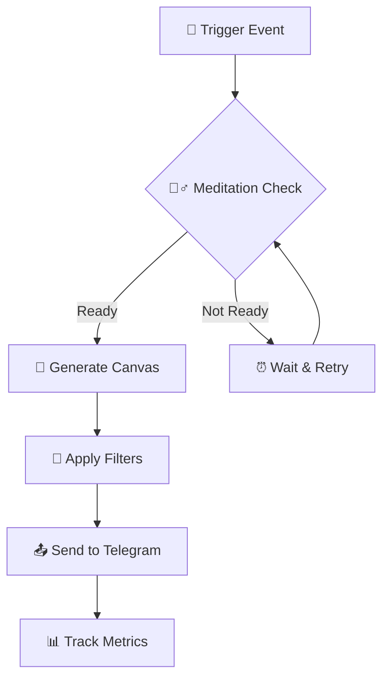

# 🌟 Интерактивные Примеры VibeCode Bible

🕉️ _"अहं ब्रह्मास्मि"_ - _"Я есть Брахман"_ - Упанишады

> Эта секция содержит интерактивные примеры, демонстрации и live playground для изучения медитативного программирования.

## 🎯 **Структура Интерактивной Документации**

### 📖 **1. Живые Примеры**

- [🚀 Быстрый старт](#quick-start-playground)
- [🧘‍♂️ Медитативный TDD](#meditative-tdd-demo)
- [🤖 Telegram Bot Примеры](#telegram-bot-examples)
- [⚡ Inngest Workflows](#inngest-workflows)

### 🎮 **2. Интерактивные Playground**

- [📝 Code Playground](#code-playground)
- [🔄 TDD Симулятор](#tdd-simulator)
- [🎨 Canvas Generator](#canvas-generator)

### 🎬 **3. GIF Демонстрации**

- [🧘‍♂️ Медитативный TDD Цикл](#meditative-tdd-gif)
- [🚀 Быстрый деплой](#quick-deploy-gif)
- [🤖 Bot Setup](#bot-setup-gif)

---

## 🚀 Quick Start Playground

```typescript
// 🧘‍♂️ Медитативный пример создания Telegram команды
import { bot } from './src/bot';
import { createWizardScene } from './src/templates/wizard-scene-template';

// ✨ Создание осознанной команды
const meditativeCommand = {
  name: 'wisdom',
  description: '🕉️ Получить мудрость дня',
  handler: async ctx => {
    const wisdom = [
      'तत्त्वमसि - Ты есть То',
      'सत्यमेव जयते - Истина побеждает',
      'अहिंसा परमो धर्मः - Ненасилие - высшая дхарма',
    ];

    const randomWisdom = wisdom[Math.floor(Math.random() * wisdom.length)];

    await ctx.reply(`🕉️ **Мудрость дня:**\n\n${randomWisdom}\n\n*Да пребудет с тобой покой* 🙏`);
  },
};

// 🎯 Регистрация команды
bot.command('wisdom', meditativeCommand.handler);
```

### 🔄 **Попробуйте сами:**

1. **Скопируйте код выше**
2. **Добавьте его в `src/commands.ts`**
3. **Запустите бота:** `bun run dev`
4. **Протестируйте:** `/wisdom` в Telegram

---

## 🧘‍♂️ Meditative TDD Demo

### 📋 **TDD Цикл в Действии**

```typescript
// 🔴 RED: Пишем падающий тест
describe('🕉️ Meditative Wisdom Service', () => {
  it('should return daily wisdom', async () => {
    const wisdomService = new WisdomService();
    const wisdom = await wisdomService.getDailyWisdom();

    expect(wisdom).toContain('🕉️');
    expect(wisdom.length).toBeGreaterThan(10);
  });
});

// 🟢 GREEN: Минимальная реализация
class WisdomService {
  async getDailyWisdom(): Promise<string> {
    return '🕉️ तत्त्वमसि - Ты есть То';
  }
}

// ♻️ REFACTOR: Улучшаем
class WisdomService {
  private wisdomQuotes = [
    '🕉️ तत्त्वमसि - Ты есть То',
    '🕉️ सत्यमेव जयते - Истина побеждает',
    '🕉️ अहिंसा परमो धर्मः - Ненасилие - высшая дхарма',
  ];

  async getDailyWisdom(): Promise<string> {
    const today = new Date().getDate();
    const index = today % this.wisdomQuotes.length;
    return this.wisdomQuotes[index];
  }
}
```

### 🎯 **Интерактивная TDD Сессия**

> **Задание:** Создайте `MeditationTimer` класс с TDD подходом

**Шаг 1:** Напишите тест для таймера на 5 минут
**Шаг 2:** Реализуйте минимальный код
**Шаг 3:** Рефакторите для поддержки кастомного времени

---

## 🤖 Telegram Bot Examples

### 📱 **Интерактивный Bot Builder**

```typescript
// 🎯 Создание интерактивного меню
const createMeditativeMenu = () => {
  return Markup.inlineKeyboard([
    [
      Markup.button.callback('🧘‍♂️ Медитация', 'start_meditation'),
      Markup.button.callback('📖 Мудрость', 'daily_wisdom'),
    ],
    [
      Markup.button.callback('🎨 Создать мотиватор', 'create_motivator'),
      Markup.button.callback('📊 Прогресс', 'show_progress'),
    ],
    [
      Markup.button.callback('⚙️ Настройки', 'settings'),
      Markup.button.callback('❓ Помощь', 'help'),
    ],
  ]);
};

// 🌟 Использование
bot.start(ctx => {
  ctx.reply(
    '🕉️ **Добро пожаловать в VibeCode Bible!**\n\n' +
      '*"सर्वं खल्विदं ब्रह्म"* - *"Всё есть Брахман"*\n\n' +
      'Выберите действие для начала медитативного программирования:',
    createMeditativeMenu()
  );
});
```

---

## ⚡ Inngest Workflows

### 🔄 **Workflow Визуализация**



### 🎯 **Live Workflow Editor**

```typescript
// 🌟 Создание медитативного workflow
export const meditativeWorkflow = inngest.createFunction(
  { id: 'meditative-content-generation' },
  { event: 'content.generate' },
  async ({ event, step }) => {
    // 🧘‍♂️ Шаг 1: Медитативная подготовка
    const preparation = await step.run('prepare-meditation', async () => {
      return {
        timestamp: new Date(),
        intention: event.data.intention || 'peace',
        energy: 'high',
      };
    });

    // 🎨 Шаг 2: Создание контента
    const content = await step.run('generate-content', async () => {
      return await generateMeditativeContent(preparation);
    });

    // 📤 Шаг 3: Отправка
    await step.run('send-content', async () => {
      return await sendToTelegram(content);
    });

    return { success: true, contentId: content.id };
  }
);
```

---

## 🎮 Interactive Playground Areas

### 📝 **Code Playground**

> **Откройте в новой вкладке:** [CodeSandbox VibeCode Playground](https://codesandbox.io/s/vibecode-playground)

**Особенности:**

- ✨ Live код редактор
- 🔄 Hot reload
- 🧪 Интегрированное тестирование
- 📊 Real-time метрики

### 🔄 **TDD Симулятор**

> **Интерактивный TDD тренажер:** [TDD Practice Arena](./tdd-simulator.html)

**Возможности:**

- 🔴 RED фаза симуляция
- 🟢 GREEN фаза практика
- ♻️ REFACTOR упражнения
- 📈 Прогресс трекинг

### 🎨 **Canvas Generator**

> **Творческая лаборатория:** [Canvas Playground](./canvas-generator.html)

**Инструменты:**

- 🖼️ Template editor
- 🎨 Style customizer
- 📱 Mobile preview
- ⬇️ Instant download

---

## 🎬 GIF Демонстрации

### 🧘‍♂️ Медитативный TDD Цикл


> **Демонстрирует:**
>
> - ⏰ 3-минутная медитация перед кодингом
> - 🔴 Написание падающего теста
> - 🟢 Минимальная реализация
> - ♻️ Осознанный рефакторинг
> - 🧘‍♂️ Благодарность после завершения

### 🚀 Быстрый деплой


> **Показывает:**
>
> - 📦 One-command setup
> - ⚡ Automated testing
> - 🚀 Deploy на Railway
> - 📊 Monitoring setup

### 🤖 Bot Setup


> **Процесс:**
>
> - 🔑 Token configuration
> - 🔗 Webhook setup
> - 🧪 Test message sending
> - ✅ Verification

---

## 🌍 Multilingual Support

### 🇷🇺 **Русская версия**

- [📖 Полная документация](./ru/README.md)
- [🚀 Быстрый старт](./ru/quick-start.md)
- [🧘‍♂️ Медитативное программирование](./ru/meditative-programming.md)

### 🇺🇸 **English Version**

- [📖 Full Documentation](./en/README.md)
- [🚀 Quick Start](./en/quick-start.md)
- [🧘‍♂️ Meditative Programming](./en/meditative-programming.md)

### 🇮🇳 **Sanskrit References**

- [🕉️ Sacred Texts](./sanskrit/sacred-texts.md)
- [📿 Programming Mantras](./sanskrit/programming-mantras.md)

---

## 📱 **Mobile-First Experience**

### 📲 **Responsive Design**

- ✅ Mobile-optimized layout
- 🔄 Touch-friendly interactions
- ⚡ Fast loading
- 📱 PWA support

### 🎯 **Quick Actions**

- 🚀 One-tap code execution
- 📋 Copy-paste friendly
- 🔗 Deep links support
- 📧 Share functionality

---

## 🎯 **Next Steps**

1. **🔗 Присоединяйтесь к сообществу:** [Telegram канал](https://t.me/vibecode_bible)
2. **🤝 Контрибьютьте:** [Contributing Guide](../CONTRIBUTING.md)
3. **🐛 Сообщайте об ошибках:** [Issues](https://github.com/playra/bible_vibecoder/issues)
4. **⭐ Ставьте звезды:** Если проект полезен!

---

_🕉️ "सत्यं ज्ञानं अनन्तं ब्रह्म" - "Истина, знание, бесконечность - есть Брахман" 🙏_

**Да пребудет с вами код и мир!** ✨
