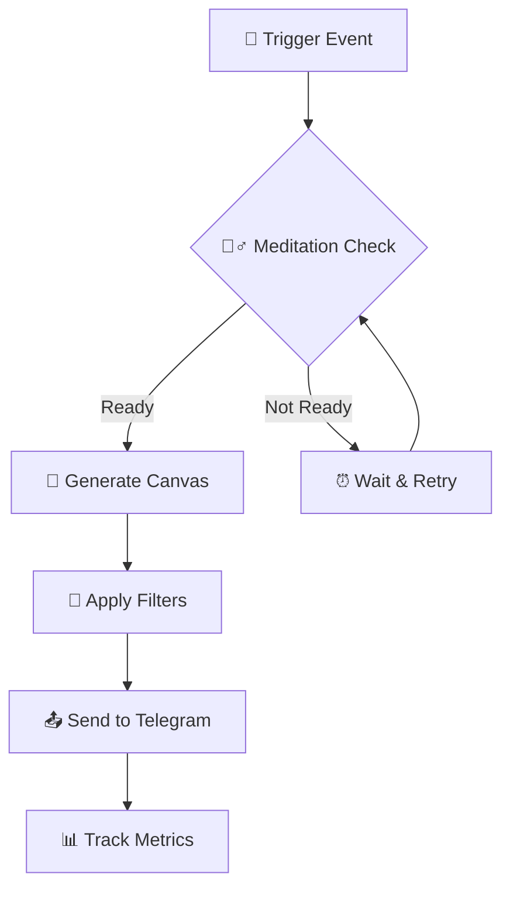

# 🌟 VibeCode Bible Interactive Examples

🕉️ _"Aham Brahmasmi"_ - _"I am Brahman"_ - Upanishads

> This section contains interactive examples, demonstrations, and live playgrounds for learning meditative programming.

## 🎯 **Interactive Documentation Structure**

### 📖 **1. Live Examples**

- [🚀 Quick Start](#quick-start-playground)
- [🧘‍♂️ Meditative TDD](#meditative-tdd-demo)
- [🤖 Telegram Bot Examples](#telegram-bot-examples)
- [⚡ Inngest Workflows](#inngest-workflows)

### 🎮 **2. Interactive Playgrounds**

- [📝 Code Playground](#code-playground)
- [🔄 TDD Simulator](#tdd-simulator)
- [🎨 Canvas Generator](#canvas-generator)

### 🎬 **3. GIF Demonstrations**

- [🧘‍♂️ Meditative TDD Cycle](#meditative-tdd-gif)
- [🚀 Quick Deploy](#quick-deploy-gif)
- [🤖 Bot Setup](#bot-setup-gif)

---

## 🚀 Quick Start Playground

```typescript
// 🧘‍♂️ Meditative example of creating a Telegram command
import { bot } from './src/bot';
import { createWizardScene } from './src/templates/wizard-scene-template';

// ✨ Creating a conscious command
const meditativeCommand = {
  name: 'wisdom',
  description: '🕉️ Get wisdom of the day',
  handler: async ctx => {
    const wisdom = [
      'Tat tvam asi - Thou art That',
      'Satyameva jayate - Truth alone triumphs',
      'Ahimsa paramo dharmah - Non-violence is the highest virtue',
    ];

    const randomWisdom = wisdom[Math.floor(Math.random() * wisdom.length)];

    await ctx.reply(`🕉️ **Wisdom of the day:**\n\n${randomWisdom}\n\n*May peace be with you* 🙏`);
  },
};

// 🎯 Register command
bot.command('wisdom', meditativeCommand.handler);
```

### 🔄 **Try it yourself:**

1. **Copy the code above**
2. **Add it to `src/commands.ts`**
3. **Start the bot:** `bun run dev`
4. **Test:** `/wisdom` in Telegram

---

## 🧘‍♂️ Meditative TDD Demo

### 📋 **TDD Cycle in Action**

```typescript
// 🔴 RED: Write a failing test
describe('🕉️ Meditative Wisdom Service', () => {
  it('should return daily wisdom', async () => {
    const wisdomService = new WisdomService();
    const wisdom = await wisdomService.getDailyWisdom();

    expect(wisdom).toContain('🕉️');
    expect(wisdom.length).toBeGreaterThan(10);
  });
});

// 🟢 GREEN: Minimal implementation
class WisdomService {
  async getDailyWisdom(): Promise<string> {
    return '🕉️ Tat tvam asi - Thou art That';
  }
}

// ♻️ REFACTOR: Improve
class WisdomService {
  private wisdomQuotes = [
    '🕉️ Tat tvam asi - Thou art That',
    '🕉️ Satyameva jayate - Truth alone triumphs',
    '🕉️ Ahimsa paramo dharmah - Non-violence is the highest virtue',
  ];

  async getDailyWisdom(): Promise<string> {
    const today = new Date().getDate();
    const index = today % this.wisdomQuotes.length;
    return this.wisdomQuotes[index];
  }
}
```

### 🎯 **Interactive TDD Session**

> **Challenge:** Create a `MeditationTimer` class using TDD approach

**Step 1:** Write a test for a 5-minute timer
**Step 2:** Implement minimal code
**Step 3:** Refactor to support custom time

---

## 🤖 Telegram Bot Examples

### 📱 **Interactive Bot Builder**

```typescript
// 🎯 Creating an interactive menu
const createMeditativeMenu = () => {
  return Markup.inlineKeyboard([
    [
      Markup.button.callback('🧘‍♂️ Meditation', 'start_meditation'),
      Markup.button.callback('📖 Wisdom', 'daily_wisdom'),
    ],
    [
      Markup.button.callback('🎨 Create Motivator', 'create_motivator'),
      Markup.button.callback('📊 Progress', 'show_progress'),
    ],
    [Markup.button.callback('⚙️ Settings', 'settings'), Markup.button.callback('❓ Help', 'help')],
  ]);
};

// 🌟 Usage
bot.start(ctx => {
  ctx.reply(
    '🕉️ **Welcome to VibeCode Bible!**\n\n' +
      '*"Sarvam khalvidam brahma"* - *"All this is indeed Brahman"*\n\n' +
      'Choose an action to begin meditative programming:',
    createMeditativeMenu()
  );
});
```

---

## ⚡ Inngest Workflows

### 🔄 **Workflow Visualization**



### 🎯 **Live Workflow Editor**

```typescript
// 🌟 Creating a meditative workflow
export const meditativeWorkflow = inngest.createFunction(
  { id: 'meditative-content-generation' },
  { event: 'content.generate' },
  async ({ event, step }) => {
    // 🧘‍♂️ Step 1: Meditative preparation
    const preparation = await step.run('prepare-meditation', async () => {
      return {
        timestamp: new Date(),
        intention: event.data.intention || 'peace',
        energy: 'high',
      };
    });

    // 🎨 Step 2: Content creation
    const content = await step.run('generate-content', async () => {
      return await generateMeditativeContent(preparation);
    });

    // 📤 Step 3: Sending
    await step.run('send-content', async () => {
      return await sendToTelegram(content);
    });

    return { success: true, contentId: content.id };
  }
);
```

---

## 🎮 Interactive Playground Areas

### 📝 **Code Playground**

> **Open in new tab:** [CodeSandbox VibeCode Playground](https://codesandbox.io/s/vibecode-playground)

**Features:**

- ✨ Live code editor
- 🔄 Hot reload
- 🧪 Integrated testing
- 📊 Real-time metrics

### 🔄 **TDD Simulator**

> **Interactive TDD trainer:** [TDD Practice Arena](./tdd-simulator.html)

**Capabilities:**

- 🔴 RED phase simulation
- 🟢 GREEN phase practice
- ♻️ REFACTOR exercises
- 📈 Progress tracking

### 🎨 **Canvas Generator**

> **Creative laboratory:** [Canvas Playground](./canvas-generator.html)

**Tools:**

- 🖼️ Template editor
- 🎨 Style customizer
- 📱 Mobile preview
- ⬇️ Instant download

---

## 🎬 GIF Demonstrations

### 🧘‍♂️ Meditative TDD Cycle


> **Demonstrates:**
>
> - ⏰ 3-minute meditation before coding
> - 🔴 Writing failing test
> - 🟢 Minimal implementation
> - ♻️ Conscious refactoring
> - 🧘‍♂️ Gratitude after completion

### 🚀 Quick Deploy


> **Shows:**
>
> - 📦 One-command setup
> - ⚡ Automated testing
> - 🚀 Railway deployment
> - 📊 Monitoring setup

### 🤖 Bot Setup


> **Process:**
>
> - 🔑 Token configuration
> - 🔗 Webhook setup
> - 🧪 Test message sending
> - ✅ Verification

---

## 🌍 Language Navigation

### 🇷🇺 **Russian Version**

- [📖 Full Documentation](../README.md)
- [🚀 Quick Start](../ru/quick-start.md)
- [🧘‍♂️ Meditative Programming](../ru/meditative-programming.md)

### 🇮🇳 **Sanskrit References**

- [🕉️ Sacred Texts](../sanskrit/sacred-texts.md)
- [📿 Programming Mantras](../sanskrit/programming-mantras.md)

---

## 📱 **Mobile-First Experience**

### 📲 **Responsive Design**

- ✅ Mobile-optimized layout
- 🔄 Touch-friendly interactions
- ⚡ Fast loading
- 📱 PWA support

### 🎯 **Quick Actions**

- 🚀 One-tap code execution
- 📋 Copy-paste friendly
- 🔗 Deep links support
- 📧 Share functionality

---

## 🎯 **Next Steps**

1. **🔗 Join the community:** [Telegram channel](https://t.me/vibecode_bible)
2. **🤝 Contribute:** [Contributing Guide](../../CONTRIBUTING.md)
3. **🐛 Report bugs:** [Issues](https://github.com/playra/bible_vibecoder/issues)
4. **⭐ Star the repo:** If you find it useful!

---

_🕉️ "Satyam jnanam anantam brahma" - "Truth, knowledge, infinity - that is Brahman" 🙏_

**May code and peace be with you!** ✨
