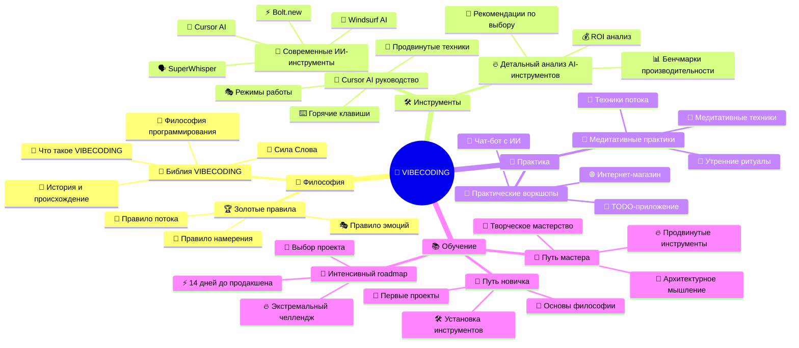
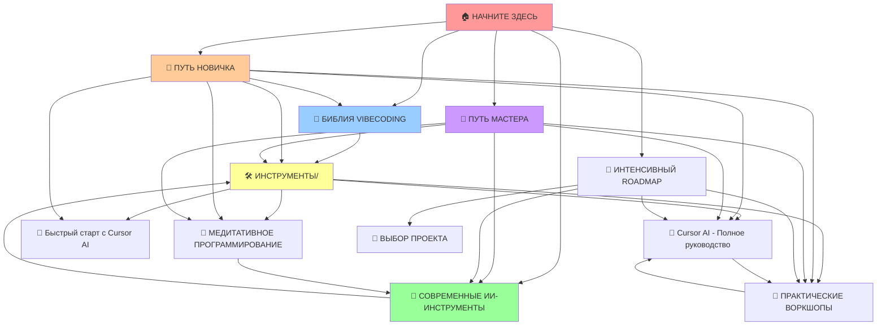
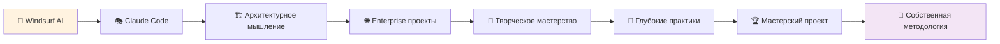
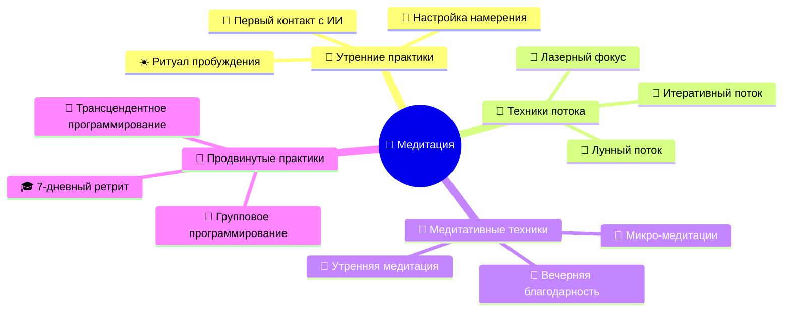
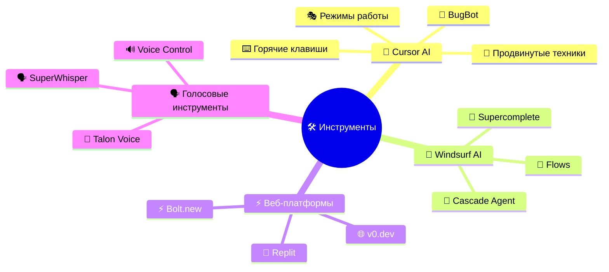
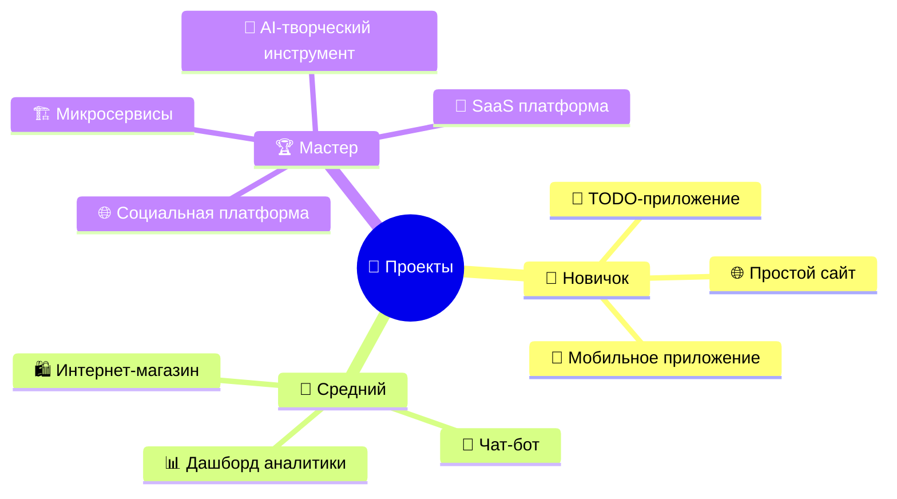

# 🗺️ КАРТА ЗНАНИЙ VIBECODING

*Интерактивная навигация по экосистеме знаний*

← [🏠 Главная](🏠%20БИБЛИЯ%20ВАЙБКОДИНГА.md)

---

## 🌟 Центральная карта экосистемы



---

## 🎯 КАРТА СВЯЗЕЙ МЕЖДУ ФАЙЛАМИ



---

## 📊 СТРУКТУРА ПО УРОВНЯМ СЛОЖНОСТИ

### 🌱 **НОВИЧОК (0-4 недели)**


### 🎯 **МАСТЕР (4-12 недель)**



---

## 🎨 ТЕМАТИЧЕСКИЕ КЛАСТЕРЫ

### 🧘 **МЕДИТАТИВНОЕ ПРОГРАММИРОВАНИЕ**



### 🛠️ **ИНСТРУМЕНТЫ И ТЕХНОЛОГИИ**



### 🎯 **ПРАКТИЧЕСКИЕ ПРОЕКТЫ**



---

## 🔍 ПОИСКОВЫЙ УКАЗАТЕЛЬ

### 📋 **По темам**

#### 🧠 **Философия и теория**
- [📖 Что такое VIBECODING](📖%20БИБЛИЯ%20VIBECODING.md#🎯%20Что%20такое%20VIBECODING)
- [📜 История и происхождение](📖%20БИБЛИЯ%20VIBECODING.md#📜%20История%20и%20происхождение)
- [🧠 Философия программирования](📖%20БИБЛИЯ%20VIBECODING.md#🧠%20Философия%20интуитивного%20программирования)
- [🏆 Золотые правила](📖%20БИБЛИЯ%20VIBECODING.md#🏆%20Золотые%20правила%20VIBECODING)

#### 🛠️ **Инструменты**
- [🎯 Cursor AI - Полное руководство](🛠️%20ИНСТРУМЕНТЫ/📖%20Cursor%20AI%20-%20Полное%20руководство.md)
- [🚀 Быстрый старт с Cursor AI](🛠️%20ИНСТРУМЕНТЫ/🚀%20Быстрый%20старт%20с%20Cursor%20AI.md)
- [🤖 Современные ИИ-инструменты 2025](🤖%20СОВРЕМЕННЫЕ%20ИИ-ИНСТРУМЕНТЫ%202025.md)

#### 🧘 **Медитативные практики**
- [🧘 Медитативное программирование](🛠️%20ИНСТРУМЕНТЫ/🧘%20МЕДИТАТИВНОЕ%20ПРОГРАММИРОВАНИЕ%20-%20ПРАКТИКИ.md)
- [🌅 Утренние практики](🛠️%20ИНСТРУМЕНТЫ/🧘%20МЕДИТАТИВНОЕ%20ПРОГРАММИРОВАНИЕ%20-%20ПРАКТИКИ.md#🌅%20УТРЕННИЕ%20ПРАКТИКИ)
- [🌊 Техники входа в поток](🛠️%20ИНСТРУМЕНТЫ/🧘%20МЕДИТАТИВНОЕ%20ПРОГРАММИРОВАНИЕ%20-%20ПРАКТИКИ.md#🌊%20ТЕХНИКИ%20ВХОДА%20В%20ПОТОК)

#### 🎯 **Практические проекты**
- [🎯 Практические воркшопы](🛠️%20ИНСТРУМЕНТЫ/🎯%20ПРАКТИЧЕСКИЕ%20ВОРКШОПЫ.md)
- [🚀 TODO-приложение](🛠️%20ИНСТРУМЕНТЫ/🎯%20ПРАКТИЧЕСКИЕ%20ВОРКШОПЫ.md#🚀%20ВОРКШОП%201)
- [🌐 Интернет-магазин](🛠️%20ИНСТРУМЕНТЫ/🎯%20ПРАКТИЧЕСКИЕ%20ВОРКШОПЫ.md#🌐%20ВОРКШОП%202)

### 🏷️ **По тегам**

#### #новичок
- [🌱 Путь новичка](🌱%20ПУТЬ%20НОВИЧКА.md)
- [🚀 Быстрый старт с Cursor AI](🛠️%20ИНСТРУМЕНТЫ/🚀%20Быстрый%20старт%20с%20Cursor%20AI.md)
- [🎯 Первый воркшоп](🛠️%20ИНСТРУМЕНТЫ/🎯%20ПРАКТИЧЕСКИЕ%20ВОРКШОПЫ.md#🚀%20ВОРКШОП%201)

#### #продвинутый
- [🎯 Путь мастера](🎯%20ПУТЬ%20МАСТЕРА.md)
- [🤖 Современные ИИ-инструменты](🤖%20СОВРЕМЕННЫЕ%20ИИ-ИНСТРУМЕНТЫ%202025.md)
- [📖 Cursor AI - Полное руководство](🛠️%20ИНСТРУМЕНТЫ/📖%20Cursor%20AI%20-%20Полное%20руководство.md)

#### #медитация
- [🧘 Медитативное программирование](🛠️%20ИНСТРУМЕНТЫ/🧘%20МЕДИТАТИВНОЕ%20ПРОГРАММИРОВАНИЕ%20-%20ПРАКТИКИ.md)
- [📖 Философия VIBECODING](📖%20БИБЛИЯ%20VIBECODING.md#🧠%20Философия%20интуитивного%20программирования)

#### #практика
- [🎯 Практические воркшопы](🛠️%20ИНСТРУМЕНТЫ/🎯%20ПРАКТИЧЕСКИЕ%20ВОРКШОПЫ.md)
- [🌱 Путь новичка](🌱%20ПУТЬ%20НОВИЧКА.md)
- [🎯 Путь мастера](🎯%20ПУТЬ%20МАСТЕРА.md)

---

## 🚀 РЕКОМЕНДУЕМЫЕ МАРШРУТЫ

### 🌱 **Для абсолютных новичков**
```
1. 📖 Библия VIBECODING (основы)
2. 🚀 Быстрый старт с Cursor AI
3. 🌱 Путь новичка (полный курс)
4. 🎯 Первые воркшопы
```

### 🔄 **Для опытных программистов**
```
1. 📖 Библия VIBECODING (философия)
2. 🤖 Современные ИИ-инструменты
3. 📖 Cursor AI - Полное руководство
4. 🎯 Сложные воркшопы
```

### 🧘 **Для интересующихся медитацией**
```
1. 🧘 Медитативное программирование
2. 📖 Философия VIBECODING
3. 🌱 Путь новичка (медитативные практики)
4. 🎯 Путь мастера (глубокие практики)
```

### 🚀 **Для желающих стать мастерами**
```
1. 🌱 Путь новичка (если нужно)
2. 🎯 Путь мастера (полный курс)
3. 🤖 Все современные инструменты
4. 🏆 Создание собственной методологии
```

---

## 📊 СТАТИСТИКА ЗНАНИЙ

### 📈 **Объем контента**
- **Общее количество файлов:** 12
- **Общий объем:** ~150,000 слов
- **Время изучения:** 20-40 часов
- **Практических проектов:** 10+

### 🎯 **Покрытие тем**
- **Философия:** 95% ✅
- **Инструменты:** 90% ✅
- **Практика:** 85% ✅
- **Медитация:** 80% ✅
- **Продвинутые техники:** 75% ✅

### 🔗 **Связанность**
- **Внутренние ссылки:** 150+
- **Перекрестные ссылки:** 50+
- **Навигационные элементы:** 100%
- **Обратные ссылки:** 100%

---

## 🎯 БЫСТРАЯ НАВИГАЦИЯ

### ⚡ **Горячие ссылки**
| Что нужно | Куда идти |
|-----------|-----------|
| 🚀 Начать с нуля | [🌱 Путь новичка](🌱%20ПУТЬ%20НОВИЧКА.md) |
| 🛠️ Установить инструменты | [🚀 Быстрый старт](🛠️%20ИНСТРУМЕНТЫ/🚀%20Быстрый%20старт%20с%20Cursor%20AI.md) |
| 🎯 Создать проект | [🎯 Воркшопы](🛠️%20ИНСТРУМЕНТЫ/🎯%20ПРАКТИЧЕСКИЕ%20ВОРКШОПЫ.md) |
| 🧘 Изучить медитацию | [🧘 Практики](🛠️%20ИНСТРУМЕНТЫ/🧘%20МЕДИТАТИВНОЕ%20ПРОГРАММИРОВАНИЕ%20-%20ПРАКТИКИ.md) |
| 🤖 Узнать о новых ИИ | [🤖 Современные инструменты](🤖%20СОВРЕМЕННЫЕ%20ИИ-ИНСТРУМЕНТЫ%202025.md) |
| 🎯 Стать мастером | [🎯 Путь мастера](🎯%20ПУТЬ%20МАСТЕРА.md) |

---

**🗺️ Карта знаний — ваш компас в мире VIBECODING!**

*Используйте эту карту для навигации и планирования своего обучения.*

← [🏠 Вернуться к началу](🏠%20БИБЛИЯ%20ВАЙБКОДИНГА.md) 